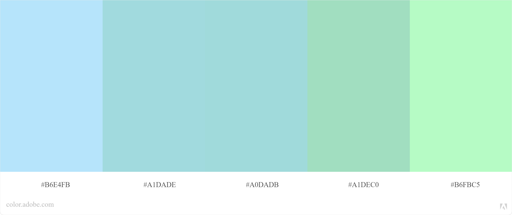
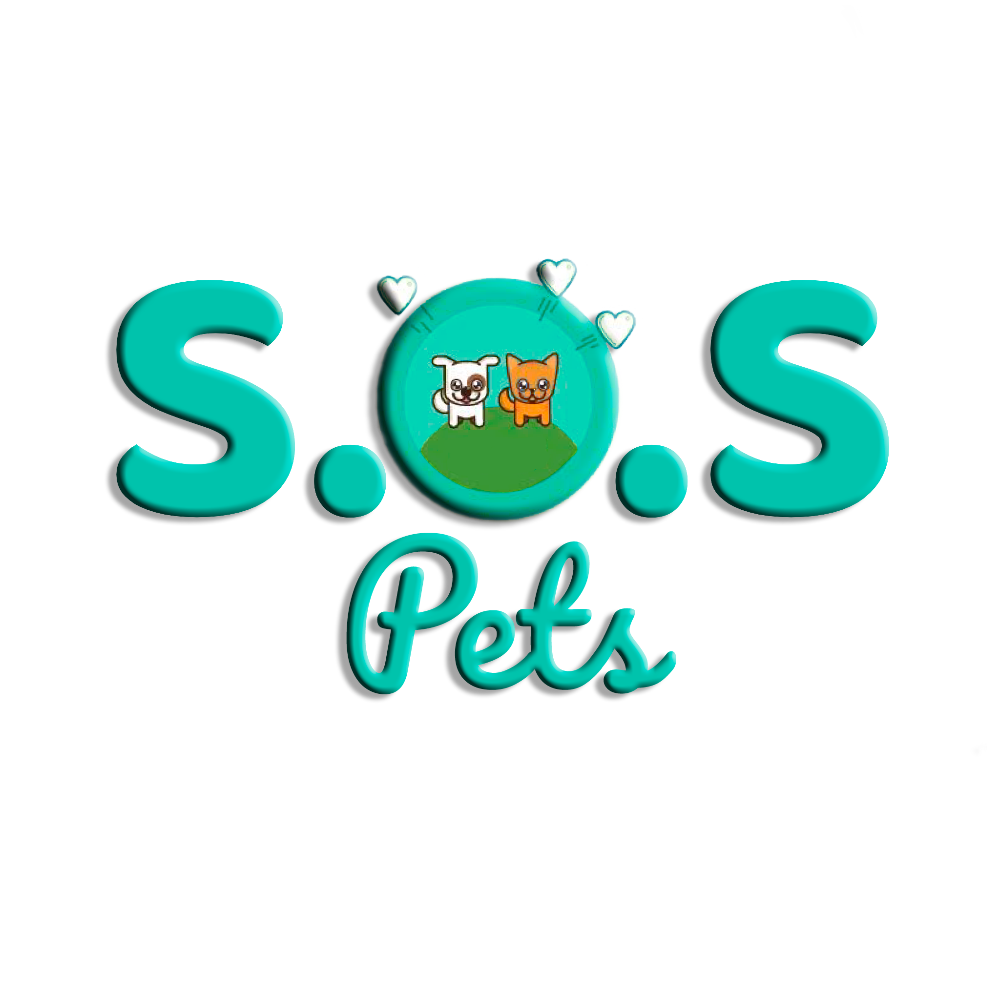

# S.O.S Pets

* [1. Introdução](#1-introdução)
* [2. Funcionamento](#2-funcionamento)
* [3. O Objetivo](#3-o-objetivo)
* [4. Planejamento](#4-planejamento)
* [5. Desenvolvimento Front End](#5-desenvolvimento-front-end)
* [6. Desenvolvedoras](#6-desenvolvedoras)

***

## 1. Introdução

A **S.O.S Pets** é uma rede social que tem por obejtivo atender as pessoas que desejam trocar experiências com atividades voltadas a divulgação de animais abandonados, perdidos e que necessitam ser adotados. Esta ferramenta proporcionará um aumento no número de contatos dos usuários, gerando mais facilidade para encontrar pessoas dispostas a realizar adoções conscientes ou que estejam interessadas em ajudar.
Os usuários terão este canal único para encontrar o que precisam, seja um novo amigo pet ou troca de experiencias e objetivos em comum.

Projeto: [S.O.S Pets]()

## 2. Funcionamento

A aplicação *mobile first* dá ao usuário a possibilidade de se cadastrar, fazer login com conta Google e login via email e senha.

Assim que o usuário acessa a página ele é direcionado para *Home* que necessita da autenticação ou cadastro do usuário. Se ele não obtiver cadastro ele pode acessar o *Register* para se cadastrar de acordo com as informações solicitadas. Após a autenticação ou cadastro, o usuário é redirecionado para o *Feed*, podendo compartilhar suas ideias, excluí-las, editar, curtir ou comentar em seu post e nos dos demais usuários. O usuário também consegue editar em seu perfil o seu nome e sua localização, além de adicionar uma foto em perfil.

## 3. O Objetivo

O objetivo deste projeto é construir uma aplicação em **SPA** *Single-Page Application*, e desenhada com enfoque em **mobile first** e utiliza a **persistência de dados** via *Firebase*.

Nesta aplicação usamos HTML5, CCS3, JavaScript (ES6+) e Firebase.

## 4. Planejamento

### Protótipo
Por meio da ferramenta *Figma*, elaboramos nosso protótipo no modelo *mobile first* e *Desktop*

### Paleta de Cores
Esta foi a paleta de cores escolhida para utilizar na nossa aplicação.
 

### Logotipo
Este foi o logotipo criado com o nome da Rede Social.
 

## 5. Desenvolvimento Front-end

* Tela Mobile 

 

 

 

* Tela Desktop 

## 6. Desenvolvedoras

    • Adriana Silva de Jesus
    • Alessandra Marinho
    • Camila Roque